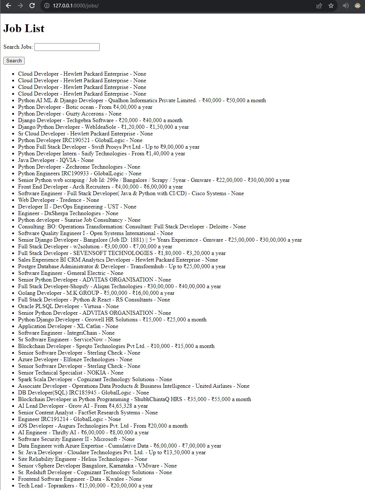
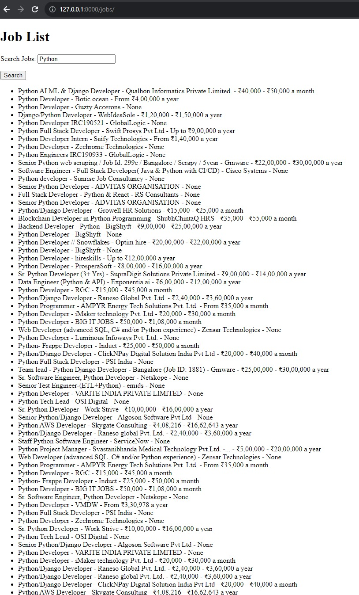

# ASTConsulting_Assignment
# Django Job Search App

This is a simple Django web application that allows users to search for job listings stored in a MongoDB database. Users can enter search keywords, and the app will display a list of matching job listings.

## Features

- Display a list of job listings from a MongoDB database.
- Allow users to search for jobs by entering keywords.

## Prerequisites

Before you begin, ensure you have met the following requirements:

- Python (3.7+)
- Django (3.2+)
- MongoDB (4.0+)
- pymongo (Python MongoDB driver)

# Indeed Job Scraper

This is a Python web scraping script that scrapes job listings from Indeed and stores them in a MongoDB database. It uses Selenium for web scraping and pymongo to interact with the database.

## Requirements

- Python 3.x
- Python packages:
  - `webdriver-manager`
  - `selenium`
  - `pymongo`

## Installation

You can install the required Python packages using pip:

## admin panel images

